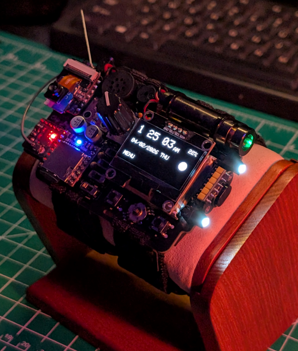
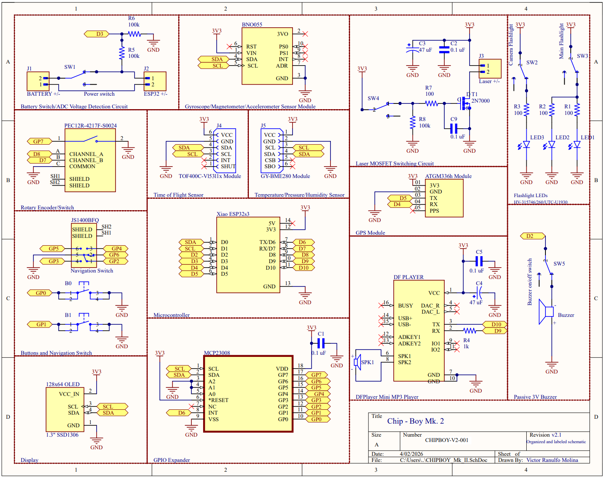

# Chip-Boy

The Chip-Boy is an ESP32-based smartwatch built on a custom PCB. It is a wrist-mounted device designed as a compact “mini computer,” focused on sensor integration, exploration, and entertainment.

The system integrates multiple sensors, including a BME280 environmental sensor, a time-of-flight distance sensor, and a BNO055 IMU for motion tracking. A 1.3" 128x64 OLED display provides a user interface, allowing navigation through menus and submenus using a combination of buttons and a rotary encoder, all operable with one hand.

The device includes an MP3 player and speaker system using a DFPlayer Mini, which reads audio files from an SD card with custom firmware and track management. It also features three white LEDs for flashlight functionality and a laser module for distance measurement and experimental use.

The ESP32-S3 Sense onboard camera and microphone enable image capture and audio recording, with files stored directly to an SD card. A GPS module provides location tracking with accuracy up to approximately 6 meters, along with automatic time and date synchronization.

Battery voltage is monitored using a voltage divider circuit connected to an ADC pin, allowing estimation of remaining battery life. The system also uses an MCP23008 I2C GPIO expander to manage inputs and control logic efficiently. A small 3V buzzer provides notifications and audio feedback. 

---

## Features

- **OLED Display Interface**  
  1.3" 128x64 OLED display with a custom menu-based UI, allowing users to navigate apps, view data, and interact with the system in real time.

- **Intuitive Input System**  
  Button-controlled navigation combined with a rotary encoder enables one-handed operation and smooth menu traversal.

- **Modular Application System**  
  Supports multiple built-in applications such as clock, navigation, compass, and media player, with the ability to expand functionality through additional modules.

- **Sensor Integration**  
  Combines multiple sensors to provide environmental, motion, and distance data for real-time feedback and analysis.

- **BNO055 IMU (Motion Tracking)**  
  Provides accelerometer, gyroscope, and magnetometer data for orientation tracking, compass functionality, and motion-based applications.

- **BME280 Environmental Sensor**  
  Measures temperature, humidity, and pressure, enabling environmental monitoring.

- **TOF400C Time-of-Flight Sensor**  
  Enables accurate distance measurement for proximity detection and navigation assistance.

- **GPS Module (Positioning & Time Sync)**  
  Provides location tracking with ~6 meter accuracy and automatic time/date calibration.

- **Camera & Microphone (ESP32-S3 Sense)**  
  Captures images and records audio, storing media directly to an SD card.

- **Audio Playback System (DFPlayer Mini)**  
  Plays MP3 files from an SD card through an onboard speaker, with custom firmware handling track selection and playback control.

- **Laser Module**  
  Used for distance indication, targeting, and experimental/measurement applications.

- **Flashlight Functionality**  
  Three high-brightness white LEDs provide illumination for low-light environments.

- **Battery Monitoring System**  
  Voltage divider connected to an ADC pin enables real-time battery level estimation.

- **Expanded I/O Control (MCP23008)**  
  I2C-based GPIO expander increases available input/output pins for buttons and peripherals.

- **Audio Feedback (Buzzer)**  
  Provides system notifications and user feedback through sound cues.

## Hardware

The Chip-Boy is built around a custom-designed embedded hardware platform integrating multiple sensors, peripherals, and user interface components onto a compact wearable PCB.

### Core System

- **ESP32-S3 (Seeed Studio XIAO)**  
  Main microcontroller responsible for system control, application execution, and peripheral interfacing. Provides Wi-Fi/Bluetooth capability, camera support, and sufficient processing power for real-time tasks.

- **Custom PCB (Altium Designer)**  
  Multi-layer board designed to integrate all components into a compact wrist-mounted form factor. Includes power routing, signal management, and modular connector interfaces.

---

### Display & User Interface

- **128×64 OLED Display (I2C)**  
  Primary user interface for rendering menus, applications, sensor data, and graphics.

- **Buttons + Rotary Encoder (via MCP23008 GPIO Expander)**  
  Enables one-handed navigation through menus and applications. The GPIO expander reduces microcontroller pin usage while supporting multiple inputs.

- **Piezo Buzzer**  
  Provides audio feedback for navigation, alerts, and system events.

---

### Sensors & Modules

- **BNO055 IMU (9-DOF)**  
  Provides orientation, acceleration, and heading data for navigation and motion-based features.

- **BME280 Environmental Sensor**  
  Measures temperature, humidity, and pressure for environmental monitoring.

- **VL53L1X Time-of-Flight Distance Sensor**  
  Enables precise distance measurement for proximity sensing and experimental applications.

- **ATGM336H GPS Module**  
  Provides real-time location data, accurate time synchronization, and navigation capabilities (~6m accuracy).

- **ESP32-S3 Camera (Sense Module)**  
  Integrated camera used for image capture and processing.

- **I2S Microphone (ESP32-S3 Sense)**  
  Enables audio recording and real-time signal capture.

---

### Audio System

- **DFPlayer Mini MP3 Module**  
  Handles audio playback from SD card storage independently of the main processor.

- **Speaker Output**  
  Provides audio output for music playback, notifications, and system feedback.

---

### Storage

- **MicroSD Card Interface**  
  Used for storing audio files, recorded data, and captured images.

---

### Power System

- **3.7V 900mAh LiPo Battery**  
  Provides portable power for the wearable device. Runtime varies based on usage. Heavy power consumption (laser, flashlight, music player) can bring the device to it's minimum operating voltage within 2.5 hours or less, while light usage and battery-saving practices can extend runtime up to 12 hours. More testing and calculations will be conducted in the near future for better analysis. 

- **Voltage Divider (ADC Monitoring Circuit)**  
  100k/100k Ohm divider allows the ESP32 to measure battery voltage and estimate remaining charge.

- **Power Switching Circuit**  
  2n7000 Mosfet switching circuit with decoupling and bulk capacitors enables safe control of system power and peripheral activation.

---

### Additional Features

- **Laser Module (MOSFET-Controlled)**  
  Used for distance assistance and experimental functionality.

- **White LEDs (Flashlight Function)**  
  Provide illumination for low-light environments.

---

### Communication Interfaces

- **I2C Bus** → Sensors, OLED display, GPIO expander  
- **SPI Bus** → SD card and high-speed peripherals  
- **UART** → DFPlayer Mini communication  
- **I2S** → Microphone audio input  
- **Camera Interface** → Native ESP32-S3 camera connection  

---

## Schematic

## Software

The Chip-Boy firmware is developed in **C++ using the Arduino framework** on the **ESP32-S3 (Seeed Studio XIAO)**. The system is designed as a **modular embedded firmware platform** that functions similarly to a lightweight operating system, managing applications, hardware interfaces, user input, and real-time data processing.

---

### System Architecture

The firmware is structured around a **state-driven application framework**, where each feature is implemented as an independent module (`.cpp/.h` pair). A centralized control loop manages global system states such as:

- Menu navigation
- Active application context
- Display updates (`uiDirty`, `displayReady`)
- Input handling from buttons and rotary encoder

Each application operates within its own state while sharing global resources such as the OLED display, SD card, and audio system.

---

### Application Modules

The system includes multiple fully integrated applications, each with dedicated logic and UI handling:

- **Camera App**  
  Captures images using the ESP32-S3 camera module. Implements a multi-stage pipeline including grayscale frame capture, image scaling to 128×64, thresholding for OLED preview, and saving both bitmap previews and full-resolution JPEGs to SD storage. :contentReference[oaicite:0]{index=0}  

- **Microphone App**  
  Records audio using I2S input at 16 kHz and dynamically constructs WAV files in memory before saving to SD. Includes real-time waveform visualization and recording state management. :contentReference[oaicite:1]{index=1}  

- **Navigation App**  
  Provides GPS-based navigation with distance and bearing calculations using the Haversine formula. Includes keypad-based coordinate entry, round-trip tracking, persistent storage using NVS (Preferences), and distance-based adaptive audio feedback. :contentReference[oaicite:2]{index=2}  

- **Location App**  
  Displays real-time time/date and location information with graphical overlays, including a world map rendered directly on the OLED. :contentReference[oaicite:3]{index=3}  

- **Radio App**  
  Manages audio playback using the DFPlayer Mini, including station-based track organization, metadata handling, shuffle functionality, and animated UI elements such as waveform rendering. :contentReference[oaicite:4]{index=4}  

- **Recordings App**  
  Interfaces with stored audio files on the SD card, enabling playback, track navigation, and UI animations synchronized with audio output. :contentReference[oaicite:5]{index=5}  

- **Battery Monitoring App**  
  Continuously samples battery voltage in the background, applies averaging and decimation to maintain long-term history, and renders a time-scaled graph of battery performance. Includes voltage-to-state-of-charge estimation using interpolation. :contentReference[oaicite:6]{index=6}  

---

### User Interface System

- Custom UI rendered using **Adafruit SSD1306 graphics library**
- Hierarchical menu system with app launching and exit handling
- Dynamic redraw control using flags to optimize performance
- Real-time visual elements including:
  - Graphs (battery monitoring)
  - Waveform animations (audio apps)
  - Image previews (camera)
  - Keypad interfaces (navigation input)

---

### Input Handling

- Multi-button input system managed through structured button state tracking
- Rotary encoder support with incremental position tracking
- Debouncing and edge detection for reliable user interaction
- Context-sensitive input handling depending on active application

---

### Communication & Hardware Interfaces

The firmware integrates multiple peripherals using standard embedded communication protocols:

- **I2C** → OLED display, sensors, GPIO expander  
- **SPI / SD interface** → File storage and media access  
- **I2S** → Audio recording (microphone input)  
- **UART** → DFPlayer Mini communication  
- **Camera interface** → ESP32-S3 native camera driver  

---

### Data Management

- SD card used for:
  - Audio recordings and playback
  - Image storage (BMP previews + JPEG files)
- Persistent storage using **ESP32 Preferences (NVS)** for saving navigation data and system states
- Real-time buffering for audio and sensor data processing

---

### Real-Time Operation

The system operates in a continuous loop with:
- Background tasks (battery sampling, sensor updates)
- Event-driven UI updates
- Non-blocking input handling
- Time-based scheduling using `millis()`

---

### Expandability

The firmware is designed for scalability, allowing new applications to be added easily by integrating additional modules into the menu system. Each feature is encapsulated, enabling independent development without modifying core system logic.

---

## How to Run

1. Open the project in Arduino IDE  
2. Select the ESP32-S3 board  
3. Install required libraries
4. Upload the code to the device  

---

## Project Purpose

This project was developed to demonstrate skills in:
- Embedded systems design  
- PCB design and hardware integration  
- Sensor interfacing  
- Real-time system development  

---

## Author

Victor Molina   
Electrical Engineer